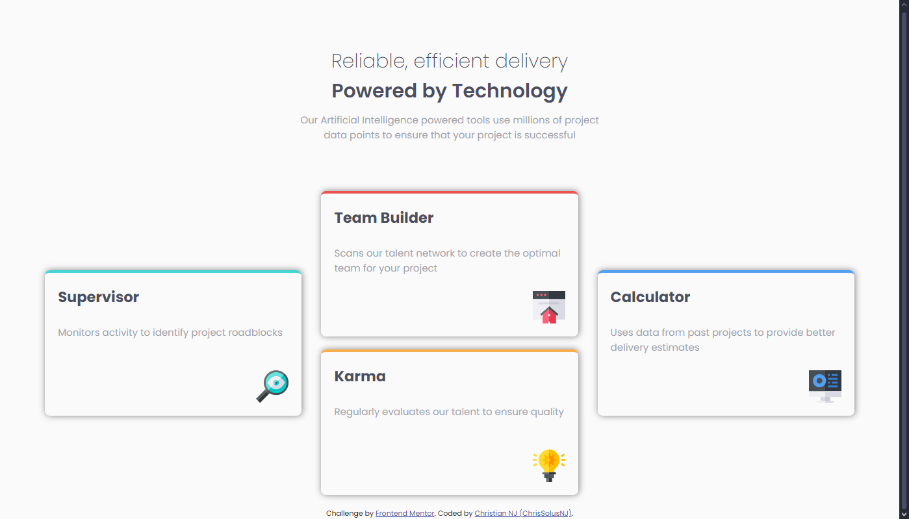
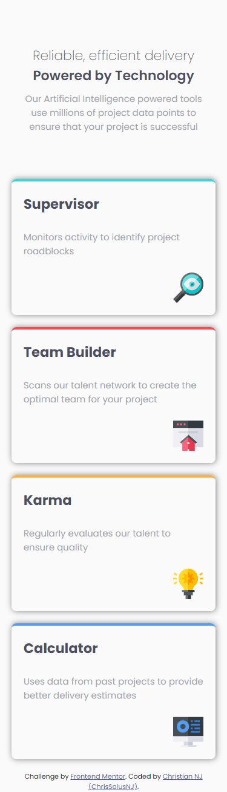

# Frontend Mentor - Product preview card component solution

This is a solution to the [Product preview card component challenge on Frontend Mentor](https://www.frontendmentor.io/challenges/product-preview-card-component-GO7UmttRfa). Frontend Mentor challenges help you improve your coding skills by building realistic projects. 

## Table of contents

- [Overview](#overview)
  - [The challenge](#the-challenge)
  - [Screenshot](#screenshot)
  - [Links](#links)
- [My process](#my-process)
  - [Built with](#built-with)
  - [What I learned](#what-i-learned)
  - [Continued development](#continued-development)
- [Author](#author)

## Overview

### The challenge

Users should be able to:

- See how elements fit together on the screen responsively with the help of CSS grid
- Learn about using CSS grid elements for responsive layouts

### Screenshot

### Links

- Solution URL: [Add solution URL here](https://www.frontendmentor.io/solutions/fourd-card-feature-section-solution-ktiqf_hSmu)
- Live Site URL: [Add live site URL here](https://chrissolusnj.github.io/Four-card-feature-section/)

## My process

### Built with

- Semantic HTML5 markup
- CSS custom properties
- Flexbox
- CSS Grid

### What I learned

I learned about using CSS grid for the layout of responsive web designs for my website

### Continued development

I would like to continue improving on the subject of CSS grid since there are many things that are complicated for me, knowing how and when to use the different units of measurement that web design provides.

## Author

- GitHub - [@ChrisSolusNJ](https://github.com/ChrisSolusNJ)
- Frontend Mentor - [@ChrisSolusNJ](https://www.frontendmentor.io/profile/ChrisSolusNJ)